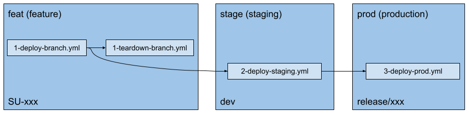

# GitHub Actions

## tl;dr

* `1-deploy-branch.yml`: PR is created for feature with a branch name starting with `SU-` & commit message of `/deploy` is made, branch is deployed
  - `2-teardown-branch.yml`: PR is merged/closed, temporary deployment torn down
* `2-deploy-staging.yml`: PR is merged into `dev`, Docker images in PR deploy are re-used and tagged as `:stage-latest` - Cloud Run instances replaced with new images
* `3-deploy-prod.yml`: PR is created with branch name starting with `release/`, once approved & merged into `dev` a repository version tag is created & `:stage-latest` images now tagged as `:prod-latest` & `:release-version`, Cloud Run instances replace with new images

### `1-deploy-branch.yml`

Creates Docker images for this branch & deploys to `feat` Core Workspace using Terraform (see <https://github.com/StageUp/core/tree/dev/terraform#core-workspaces> for explanation)

- `ctx`: Gets branch name (lower-cased) & SHA of commit that caused the workflow run
- `do_deploy`: Decides if the branch should be deployed - `/deploy` contained in commit body, creates Deployment Log comment
- `install_deps`: Installs npm dependencies from package.json (checks cache first)
- `create_backend_image`: Runs `generate:xlf` for backend & then builds backend Docker image, uploading to Container Registry once complete, tagging `:latest` & `:SHA`
- `create_frontend_image`: Runs `generate:xlf` for frontend & then builds frontend Docker image, uploading to Container Registry once complete, tagging `:latest` & `:SHA`
- `tf_deploy`: Creates Terraform workspace for branch (if none), and then deploys images/databases using scripts in `/terraform`, sets up webhook fan-out endpoint using <https://github.com/StageUp/webhooks>
- `comment`: Comments status of deployment in PR thread

### `1-teardown-branch.yml`

Tears down branch deploy & deletes Terraform Workspace.

- `ctx`: Checks if branch was deployed, skips if not, else gets the branch name (lowercased) for next job to use
- `delete_infra`: Tears down branch deployment from GCP, removes webhook endpoint fan-out from `webhooks`, updates Deployment Log PR comment with closure notice

### `2-deploy-staging.yml`

When a branch starting with `SU-` is merged into `dev`, takes Docker images created in `1-deploy-branch.yml` (if it was deployed) & tags with `:stage-latest` tags, deploys these images to `stage` Core Workspace & performs migrations

- `ctx`: Checks is `SU-XXX` branch that was merged into `dev`, gets short SHA of commit
- `check_has_images`: Verifies using Cloud SDK that images exist for this PR, won't deploy unless both exist
- `add_tags`: Adds `:stage-latest` & `:stage-SHA` (where `SHA` is a shortened version of the commit SHA that called this workflow run) tags to latest PR images for deployment into staging
- `deploy`: Runs Terraform script to deploy latest staging images
- `slack`: Posts message on Slack informing of deployment status

### `3-deploy-prod.yml`

Almost identical to `2-deploy-staging.yml`.  
When a branch starting with `release/` is merged into `dev`, takes `stage:latest` Docker images & tags as `release:latest`, deploys these images to `prod` Core Workspace & performs migrations

- `ctx`: Checks is `release/` branch that was merged into `dev`
- `check_has_images`: Verifies using Cloud SDK that images exist for this PR, won't deploy unless both exist
- `add_tags`: Adds `:prod-latest` & `:release-VERSION` (where `VERSION` is the repository tag) tags to latest PR images for deployment into production
- `deploy`: Runs Terraform script to deploy latest production images
- `slack`: Posts message on Slack informing of deployment status

## Secrets <https://github.com/StageUp/core/settings/secrets/actions>

- `GCP_PROJECT_ID`: Project ID from dashboard, e.g. `core-314910`
- `LOAD_BALANCER_URL`: Domain, e.g. `stageup.uk`, no protocol or trailing slash
- `TF_GCP_SA_KEY`: Service Account with permissions for all Terraform-required infra.
- `XLF_GCP_SA_KEY`: Service Account for Translate API (`generate:xlf`)
- `SLACK_STAGEUP_BOT_OAUTH_TOKEN`: OAuth Token for Slack bot to post comments about deployment <https://api.slack.com/apps/A01LU075W94/install-on-team?success=1>
- `SU_WEBHOOKS_API_KEY`: Auth key for <https://github.com/StageUp/webhooks>
- `CLOUD_BUILD_GCP_SA_KEY`: Service Account with Cloud Registry permissions

### Staging

- `STRIPE_TEST_PUBLIC_KEY`: Test Stripe public key (for frontend environment)
- `STRIPE_TEST_SECRET_KEY`: Test Stripe secret key (for testing Terraform deploys)

### Production

- `STRIPE_PROD_PUBLIC_KEY`: Production public key
- `STRIPE_PROD_SECRET_KEY`: Production private key

