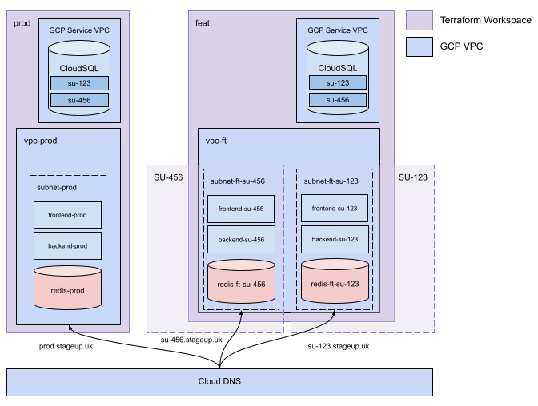
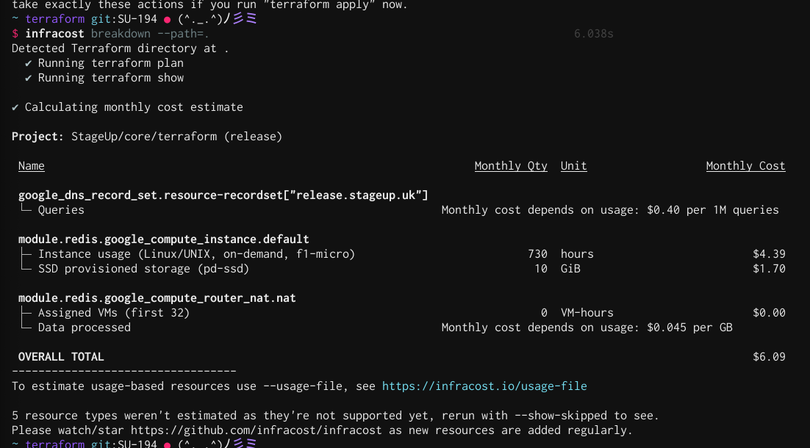

# IaC - [Notion](https://www.notion.so/Deployment-Documentation-91363ce9292e4b009413e44bb1c8d86b)

Contains all Terraform related code for setting up entire infrastructure to run this mono-repo.

## Installing `gcloud` & `terraform`

For Terraform CLI follow this guide: <https://www.terraform.io/downloads.html>

For `gcloud` CLI:

```bash
brew install --cask google-cloud-sdk
gcloud components update
gcloud auth login
gcloud config set project <my-project>
gcloud config list

gcloud services enable \
    cloudresourcemanager.googleapis.com \
    compute.googleapis.com \
    iam.googleapis.com \
    oslogin.googleapis.com \
    servicenetworking.googleapis.com \
    sqladmin.googleapis.com
```

## Core Workspaces

Contains things that should never be destroyed, VPC's, databases, private IPs etc. <br/>
Only need to run this _once_ per GCP project.



- Three distinct _core_, non-ephemeral workspaces (see `terraform/core`):
  - `prod` production environment, higher auto scaling / machine specs & real API keys
  - `stage` staging environment, exact same as production, but with test API keys
  - `feat` feature environment, slightly different configuration as prod/staging for faster development, lower specs & test API keys

### feat

**feat** is a special workspace that will be used as the core workspace for feature branch workspaces, all branch deploys will use the **feat** VPC & SQL database.

Visualised as separate workspaces:

- **feat**: VPC, SQL & private IP
  - **su-341**: Cloud Run (API & NGINX), Redis Compute, SQL DB & user etc.
  - **su-148**: ""
  - **su-745**: ""
- **prod** All of **feat** & feature branches
- **stage** All of **feat** & feature branches

### Setting up core workspaces

For a new GCP project, from this directory do:

```bash
cd core/
sh setup.sh # follow any instructions
```

## Deploying

Due to how Terraform works you can't deploy the core infra. on `stage` & then also the ephemeral infra. on `stage` at the same time on the same workspace, the states would just remove each other on `apply`.

| Core Workspace | Workspace      | URL                           |
| -------------- | -------------- | ----------------------------- |
| prod           | release        | https://release.stageup.uk/en |
| stage          | dev            | https://dev.stageup.uk/en     |
| feat           | su-123, su-456 | https://su-XXX.stageup.uk/en  |

In the same way that branch deploys use `su-123` workspace (`terraform workspace select su-123`), `prod` & `stage` do the same, `prod` maps to `release` and `stage` maps to `dev`. So setting up core & normal infra looks like this:

```bash
terraform init

# set up core infra
terraform workspace select stage
terraform -chdir=terraform/core -var "gcp_project_id=GCP_ID" -var "workspace=stage" apply

# set up other infra, stage -> dev
terraform workspace select dev
terraform -chdir=terraform/core \
  -var "workspace=stage" \
  -var "gcp_project_id=GCP_ID" apply
```

_n.b._ it looks like [Terragrunt](https://terragrunt.gruntwork.io/) would solve this issue since you can generate tf code depending on environment, but I don't have time to implement it.

## Performing Terraform commands

- Grab a service account key from [terraform@core-314910.iam.gserviceaccount.com](https://console.cloud.google.com/iam-admin/serviceaccounts/details/108490880570864712407/keys?organizationId=818397748082&project=core-314910)
- Save the key as `terraform.service_account.json` in this directory
- Run `terraform init`

### Enabling service account to perform domain mapping

By default the newly created service account won't have access to make domain mappings on the `stageup.uk` (or any other) domain, you need to add the service account as a verified owner of the domain:

- Go to <https://www.google.com/webmasters/verification/home>
- Click the `stageup.uk` property
- Click `Add Owner`
- Add the service account e-mail, something like `SERVICE_NAME@core-314910.iam.gserviceaccount.com`
- Save & Done!

---

# Notes

Some stuff for safe keeping

### Bastion host

```bash
ssh-keygen -t rsa -C "USER@stageup.uk"
gcloud compute os-login ssh-keys add --key-file=~/.ssh/id_rsa.pub --ttl=365d

# get your ssh username
gcloud compute os-login describe-profile | grep username
ssh -t <username>@<proxy-public-ip-address>

# then once you're in
sudo passwd
sudo docker run --rm --network=host -it postgres:11-alpine psql -U admin -h localhost -d postgres
```

### Gotchas

`terraform destroy` will fail to delete DB user if the CloudSQL instance has been destroyed already

```bash
# delete the user from tf state
terraform state rm google_sql_user.db_user
terraform destroy $@
```

# Deployment - [Miro](https://miro.com/app/board/o9J_lZ6kqD4=/?moveToWidget=3074457353528169240&cot=14)

At the end of every sprint a release will be deployed, going through a number of checks in the staging area & then onto production.
To be able to create a release first:

## 1st time setup

Require a Personal Access Token in order for _shipjs_ to create pull requests on your behalf.

- Create a new token: <https://github.com/settings/tokens>
- Add a `.env` into the root directory
- Add value called `GITHUB_TOKEN=XXXX`

## Triggering a release

- All code/PRs merged into `dev` ready for release
- Prepare release by running `npm run release`, which will:
  - Switch to `dev` branch
  - Create a release PR on GitHub via _shipjs_
  - Add to the CHANGELOG.md with all the Conventional Commits PR titles
- Squash-merge release PR into dev
  - `3-deploy-prod.yml` will run upon merging into `dev` & deploy new code to production

## [Infracost.io](https://www.infracost.io/docs/)

Is a tool for calculating costs of infrastructure by using the current Terraform state.



```bash
brew install infracost
infracost register


# for ephemeral infra
cd terraform
terraform workspace select stage # or any other ws like prod, su-131
infracost breakdown --path=.

# for core infra
cd terraform/core
terraform workspace select stage # or any other ws like prod, su-131
infracost breakdown --path=.
```
